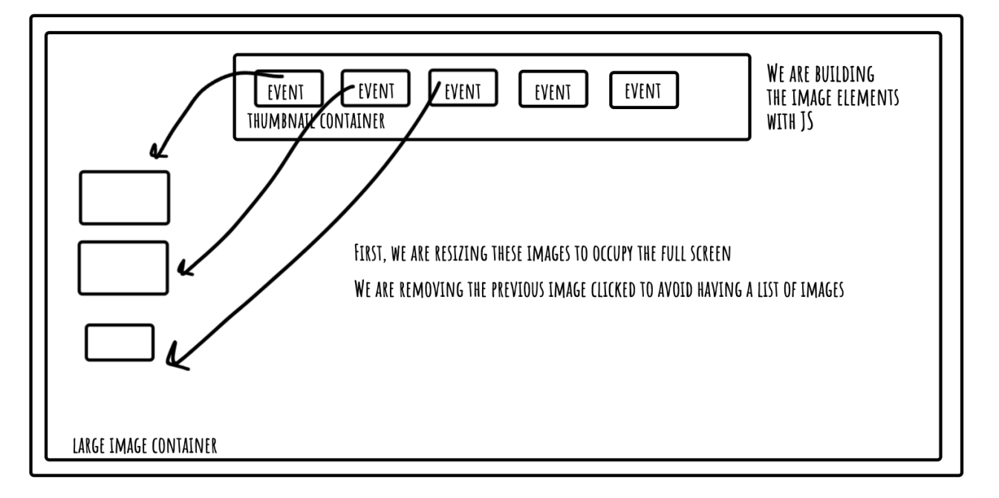

### Required

🎯 What requirements did you achieve?

- I feel that I completed the 3 main requirements. My page is not the most stylish again, but it does the job.

🎯 Were there any requirements or goals that youwere unable to achieve?

- I was not able to complete all the stretch requirements, also I wanted my thumbnails to have a red border when the user used the buttons to navigate the images.

🎯 If so, what was it that you found difficult about these tasks?

- I was not able to complete the announcement part for the screen readers, I understand from reading online that I need I hidden div in the html, however I was not able to figure out where I would hook that up in the Javascript. I am a little disappointed but I feel with more time I could of figured it out.

- I did have an issue with getting my first image to work on page load, for example image one should display as default, I eventually realised that I hadn't called the function to create images handler like I called my thumbnail.
  `createLargeImagesHandler(images[imageIndex]);`

- I did find it difficult for the tabIndex because my thumbnail images are created dynamically in JS so I had to research and found that `setAttribute` would work, I have seen this before in tutorials but not setting a tabIndex

Optional

🏹 Feel free to add any other reflections you would like to share about your submission, for example:

- Can I have feedback about my assignment please, I am happy to talk through it if you have any questions.

This is tabIndex [link](https://tetralogical.com/blog/2024/04/04/when-to-use-tabindex-0/#:~:text=You%20need%20to%20apply%20tabindex,content%20using%20the%20arrow%20keys.)

MDN tabIndex [tabIndex](https://developer.mozilla.org/en-US/docs/Web/API/Element/setAttribute)

How to get arrow keys on event listeners [ArrowKeys](https://plainenglish.io/blog/how-to-detect-arrow-key-presses-in-javascript-2c38192de0e8)

##

Side Note  
I am not happy about the event listeners on all thumbnails, I had three but if there was 20 it would have been better with event delegation, I did mention this breifly to Joe on friday. I would have liked to have added one event to the thumbnail container and then if the user clicked a certain thumbnail with a certain class then change the image. The issue I had when thinking about it was that I would know how to implement event delegation if removing an element, but this was more dynamic and that is where my level stops.
